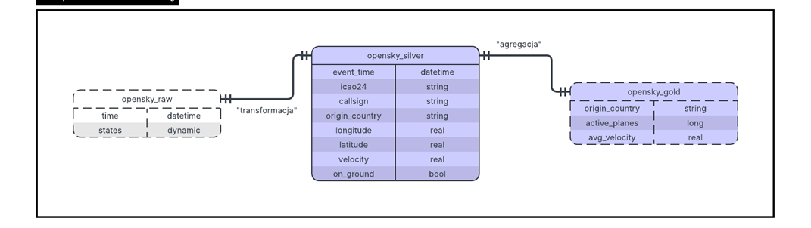
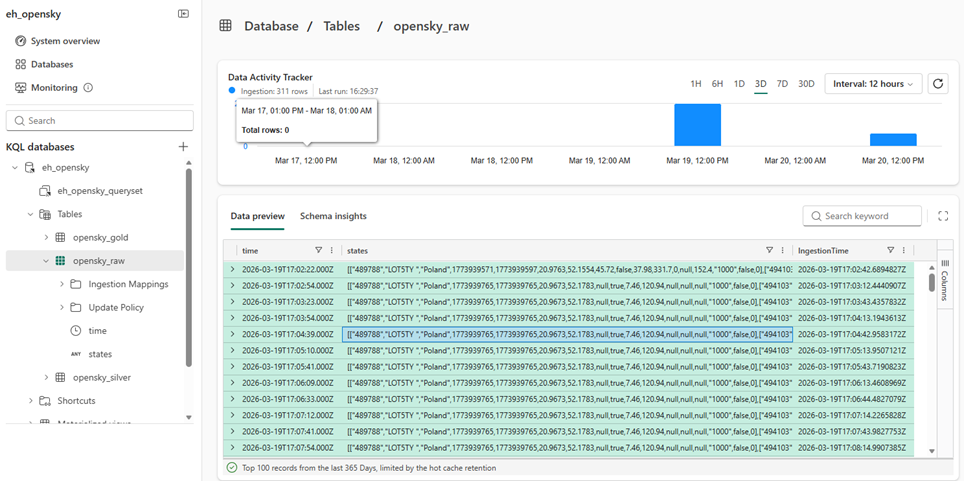
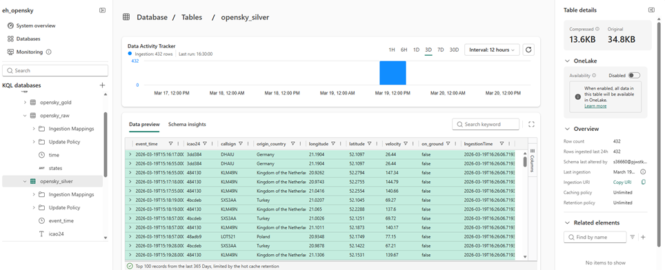
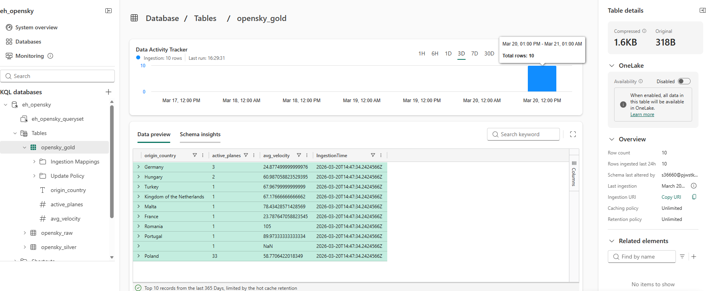
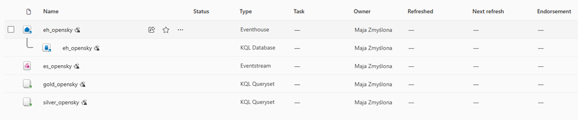
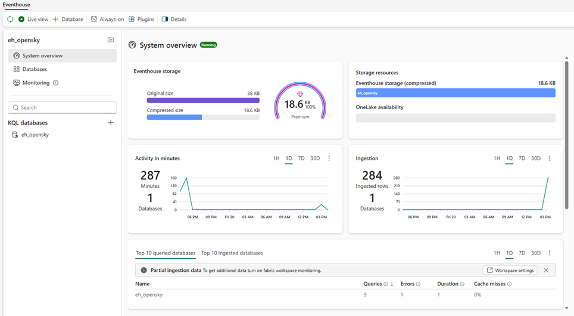
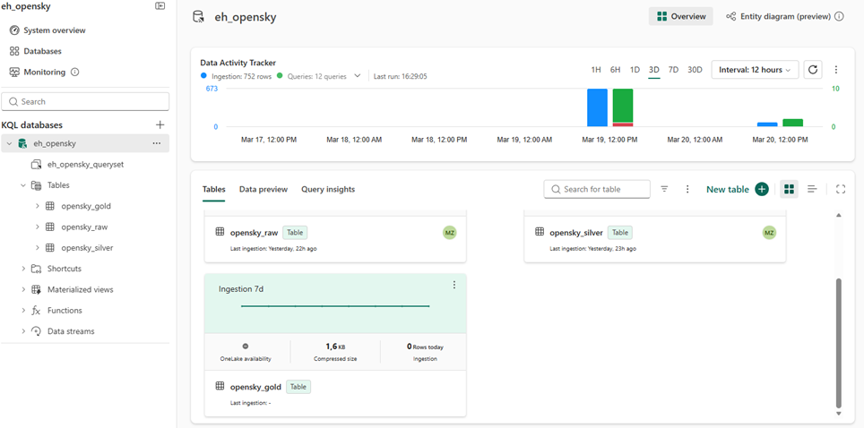

# Real-Time ELT Pipeline in Microsoft Fabric - OpenSky Air Traffic Monitoring

## Problem Statement
The goal of this project is to build a near real time ELT pipeline in Microsoft Fabric using medallion architecture to monitor air traffic over a selected geographic area.  
Flight data is ingested from the OpenSky REST API into Microsoft Fabric Eventhouse, transformed into structured flight level records, and aggregated into analytical metrics such as the number of active aircraft and average velocity by country of origin.

---

## Architecture
- Source: OpenSky REST API
- Ingestion: Fabric Eventstream
- Storage: Eventhouse / KQL Database
- Bronze: `opensky_raw`
- Silver: `opensky_silver`
- Gold: `opensky_gold`



---

## Bronze Layer
Raw JSON snapshots from OpenSky API are ingested into `opensky_raw`.

Schema:
- `time` - datetime
- `states` - dynamic



---

## Silver Layer
The `states` array is expanded into structured flight-level records in `opensky_silver`.

Schema:
- `event_time` - datetime
- `icao24` - string
- `callsign` - string
- `origin_country` - string
- `longitude` - real
- `latitude` - real
- `velocity` - real
- `on_ground` - bool



---

## Gold Layer
Aggregated metrics are calculated and stored in `opensky_gold`, including:
- number of active aircraft by country
- average velocity by country

Schema:
- `origin_country` - string
- `active_planes` - long
- `avg_velocity` - real



---

## Platform Overview

### Fabric Workspace


### Eventhouse Overview


### Tables Overview


---

## Data Quality Risks
1. Duplicate aircraft across snapshots  
   The same aircraft may appear in multiple consecutive snapshots, which can lead to double counting in analytical queries.

2. Missing or null values  
   Some fields such as `callsign`, `velocity`, or coordinates may be missing or null, which can affect transformations and aggregations.

3. Snapshot inconsistency and API latency  
   The API provides periodic snapshots rather than continuous events, so temporary delays or polling intervals may affect real-time accuracy.

---

## Technologies
- Microsoft Fabric
- Eventstream
- Eventhouse
- KQL
- OpenSky REST API

---

## Files
- `opensky_pipeline.kql` - reproducible KQL script
- `architecture.png` - high-level architecture and logical flow
- `screenshot_1.png` - Fabric workspace objects overview
- `screenshot_2.png` - Eventhouse system overview
- `screenshot_3.png` - database tables overview
- `screenshot_4.png` - Bronze layer preview
- `screenshot_5.png` - Silver layer preview
- `screenshot_6.png` - Gold layer preview

---

## Reproducible KQL Script
The project logic is implemented in `opensky_pipeline.kql` and includes:
- creation of Silver and Gold tables
- transformation from Bronze to Silver
- aggregation from Silver to Gold

### Example Silver Transformation
```kql
.set-or-append opensky_silver <|
opensky_raw
| mv-expand states
| extend
    event_time = ['time'],
    icao24 = tostring(states[0]),
    callsign = trim(" ", tostring(states[1])),
    origin_country = tostring(states[2]),
    longitude = todouble(states[5]),
    latitude = todouble(states[6]),
    velocity = todouble(states[9]),
    on_ground = tobool(states[8])
| project event_time, icao24, callsign, origin_country, longitude, latitude, velocity, on_ground
```

### Example Gold Aggregation
```kql
.set-or-replace opensky_gold <|
opensky_silver
| summarize
    active_planes = dcount(icao24),
    avg_velocity = avg(velocity)
by origin_country
| top 10 by active_planes desc
```

---

## Summary
This project demonstrates how Microsoft Fabric can be used to implement a medallion-style ELT pipeline on near-real-time API data using Bronze, Silver, and Gold layers.
